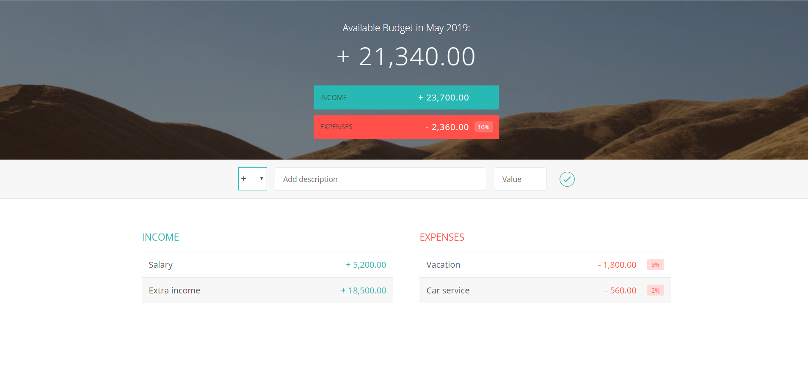

<h1>Budget Calculator</h1>
<ul>
    <li>Add Income</li>
    <li>Add Expences</li>
    <li>Calculate Percentages</li>
    <li>Display Month/Year</li>
    <li>Delete Income and Expenses</li>
</ul>

Here is the link: https://jacquesme.github.io/Budget-Calculator/

